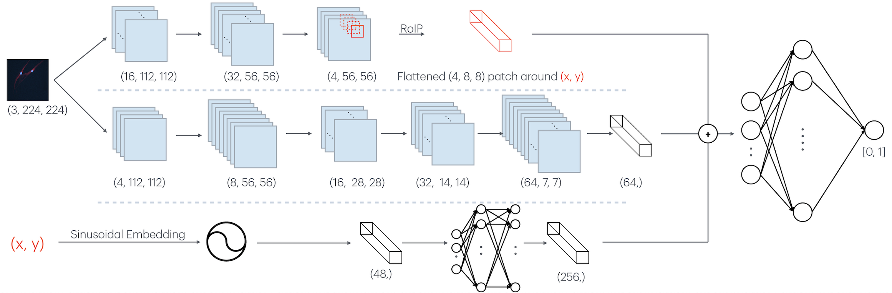

# Segmentation Based Cell Classification

This project aims to both segment and classify cells visible on microscope captures produced by the DKFZ.
Parts of the collected data are available in this repository in `data/raw/labels/`, which include the original microscope images as base64 strings, as well the mask and class labels for the individual cells visible in the images.


As this is a work in progress, the dataset is not complete yet and the labeling may contain inaccuracies.

## Approach
This project utilizes a two stage approach for segmentation and classification. 


The classifier is a standard convolutional natwork with strided convolutions for downsampling that receives a 224x224 cutout and returns a class.


The segmentation model uses a coordinate based approach where the model recieves both an image and a (x, y)-coordinate within that image and decides whether or not that coordinate is occupied by a cell.

*The image is processed via a global encoder that captures global information about the image, as well as a local encoder that produces features maps. These features maps are then sampled into via a Region-of-Interest Pooling similar to [Faster R-CNN](https://arxiv.org/pdf/1506.01497) that collects and flattens a patch region around the provided (x, y coordinate). The (x, y) coordinate itself is sinusoidally embedded and then processed by a feed forward model, before it is concatenated with the global representation, the local patch representation and fed through a standard feed forward head.*


## Usage
Install the project and the dependencies by running
```bash
git clone git@github.com:Kit115/SegmentationBasedCellClassification.git && uv sync
```

Run the dataset preparation script to create a train, validation and test split from the raw dataset
```bash
uv run data/prepare_data.py
```

Run the evaluation with the in the repository provided checkpoints
```bash
uv run evaluate.py
```

Train your own checkpoints with either
```bash
uv run train_segmentation.py
```
or 
```bash
uv run train_classification.py
```


## Preliminary Results
When trained on the currently available data with the default data split of train/val/test of 70/10/20 we obtain the following (preliminary) evaluation results on the test set:
```
Detection Metrics:
Recall:    97.95%
Precision: 99.17%
---
Classification Metrics:
Accuracy:  94.47%
```
